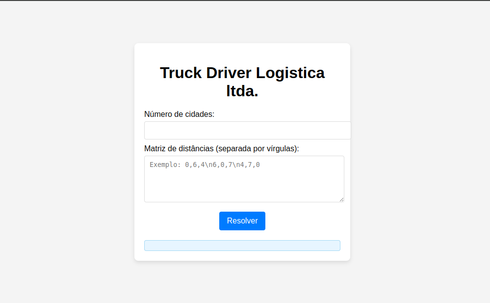
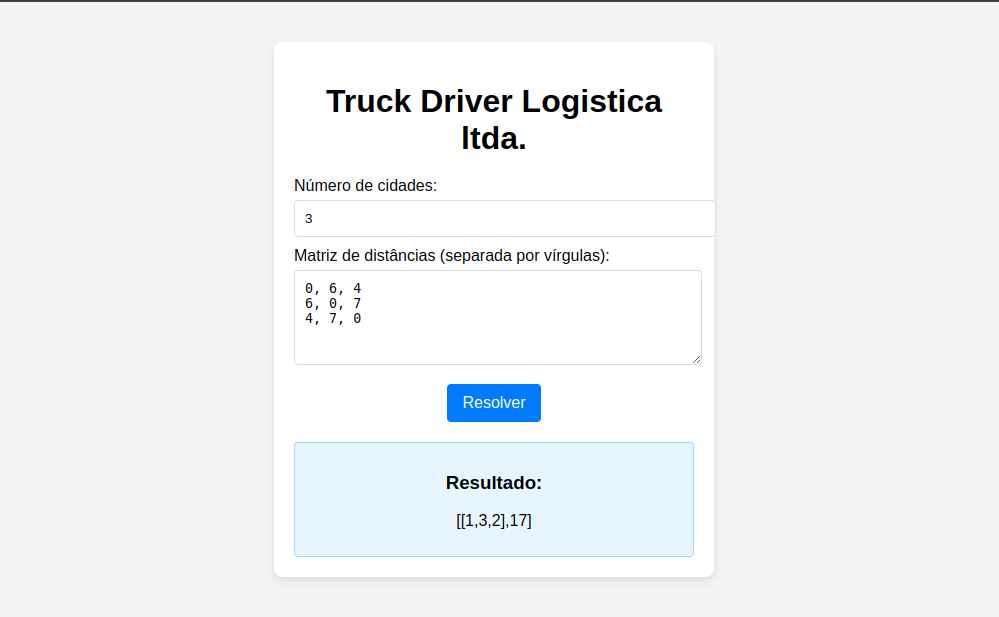

<h1><p style="text-align: center; color: #f8f9fd; font-size: 2em;">Algoritmo Genético</p></h1>

<p align="center">
    
    
    
    
</p>


<p>Este projeto implementa um algoritmo de otimização para resolver o problema do caixeiro viajante (TSP) utilizando métodos como busca local e algoritmo genético. Ele calcula a melhor rota para um conjunto de cidades, minimizando o custo da viagem.</p>

<h2>Funcionalidades</h2>
<ul>
  <li><strong>Busca Local</strong>: O algoritmo realiza uma busca local trocando duas cidades consecutivas na rota até encontrar uma solução mais eficiente.</li>
  <li><strong>Algoritmo Genético</strong>: O algoritmo genético é usado para explorar a solução em um espaço maior e mais variado, evoluindo a população de rotas com mutações e combinações.</li>
  <li><strong>Interface Web (Flask)</strong>: Um servidor web simples com Flask para interação via formulário, permitindo que o usuário forneça a matriz de distâncias entre as cidades e visualize a solução otimizada.</li>
</ul>

<h2>Tecnologias Utilizadas</h2>
<ul>
  <li><strong>Python</strong>: Linguagem principal para a implementação do algoritmo.</li>
  <li><strong>Flask</strong>: Framework para criação da API e interface web.</li>
  <li><strong>Algoritmo Genético</strong>: Implementação de um algoritmo para otimização do caminho do caixeiro viajante.</li>
  <li><strong>Busca Local</strong>: Algoritmo simples de busca local para melhorar a solução.</li>
</ul>

<h2>Como Executar</h2>

```bash
pip install Flask

```

<li>Clone o repositório:</li>

```bash
git clone https://github.com/GerlianeChaves/AlgoritmoGenetico.git
```

<li>Entre no diretório do projeto:</li>

```bash
cd AlgoritmoGenetico
```

<li>Execute o script:</li>

```bash
python appflask.py
```
</ol>

<h2>Exemplo de Execução</h2>
<p>Para rodar o algoritmo, basta informar o número de cidades e as distâncias entre elas no formato de matriz.</p>

## Exemplo de entrada para a matriz de distâncias:
<pre>
3

0 10 15
10 0 20
15 20 0
</pre>

<p>O algoritmo retornará a melhor rota e seu custo total, usando tanto a busca local quanto o algoritmo genético.</p>

<h2>Resultados</h2>
<div style="text-align: center;">
    
    
</div>

<!--<p align="center">  </p> <h3 style="color: #f8f9fd;">

<p align="center">  </p> <h3 style="color: #f8f9fd;">-->


## Contribuindo

Pull requests são bem-vindos. Para mudanças significativas, abra uma issue primeiro
para discutir o que deseja alterar.

Por favor, atualize os testes conforme necessário.

## Licença

[MIT](https://choosealicense.com/licenses/mit/)